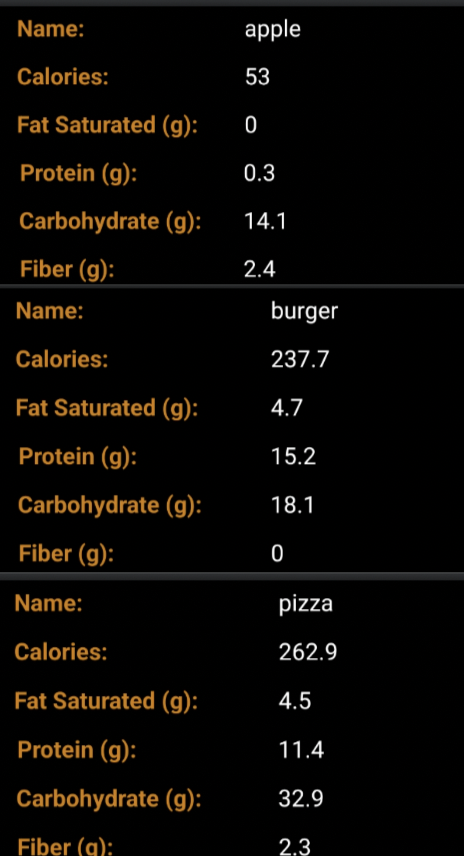
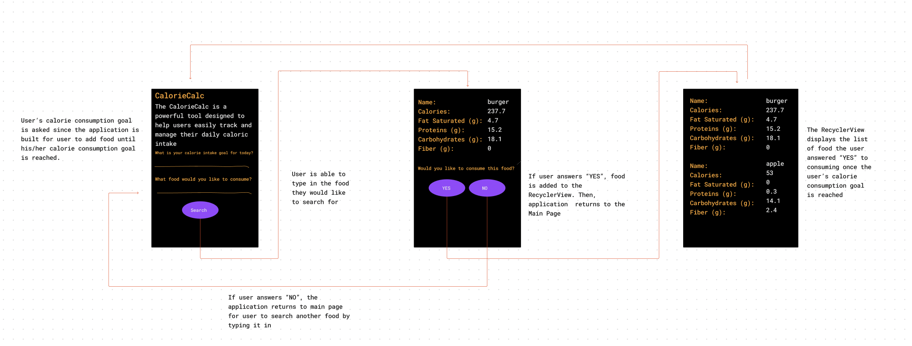

# **CalorieCalc**

## Table of Contents

1. [App Overview](#App-Overview)
1. [Product Spec](#Product-Spec)
1. [Wireframes](#Wireframes)
1. [Build Notes](#Build-Notes)

## App Overview

The CalorieCalc is a powerful tool designed to help users easily track and manage their daily caloric intake. Whether you're looking to maintain a healthy lifestyle, lose weight, or gain muscle, CalorieCalc provides real-time feedback on your calorie consumption, helping you stay on track with your nutrition goals.

### Description

**The CalorieCalc will fetch data such as the food name, the amount of calories, and other nutrients details from a Food API. The App will ask the user if they would like to consume the food being displayed. If the user answers yes, the food will be added to a RecyclerView. The user will be able to add food to the RecyclerView until his/her calorie intake goal for the day is met. Once the calorie goal is met, the application will display a RecycleView which contains all of the food the user answered yes to consuming.**

### App Evaluation

<!-- Evaluation of your app across the following attributes -->

- **Category:**
- **Mobile:**
  How uniquely mobile is the product experience?
  The product experience is unique because it emerges and engages the user into taking care of their health by being more aware of the food consumed.

  What makes your app more than a glorified website?
  The value Calorie App brings to the table is unparallel because it's aimed to benefit one's health. This is the sole reason why Calorie App is more than just a website.

- **Story:**
  How compelling is the story around this app once completed?
  The journey started when we all wanted to start eating healthier at some point in our lives. We all shared how hard it was to keep count of the calories consume since often times you forget what you are consuming throughout the day. This is when the idea of Calorie App was borned, an application intended to count the amount of calories consumed.

  How clear is the value of this app to your audience?
  The application value is priceless to our audience since it has to do with health. The message to our audience is clear and concise as this application is designed to keep count of their calories by calculating the amount of calories consumed by the user based on the food selected.

  How well would your friends or peers respond to this    product idea?
  My friends and peers were synchronized with the product idea as it is extremely beneficial for one's health. The response was incrediable as we all agreed on the product idea immediately.

- **Market:**
  How large or unique is the market for this app?
  The market is enormous as the fitness, health, and gym club industry is 30 billions in the United States.

  What's the size and scale of your potential user base?
  The calorie application has the potential to scale globally. With today's internet accessibility, Calorie App's vision is to become the ideal application used to measure one's calorie consumption.

  Does this app provide huge value to a niche group of people?
  The application is intended for people in the fitness and health industries, but truthfully anyone can greatly benefit from it. Anyone seeking to better their health.

  Do you have a well-defined audience of people for this app?
  Yes, we have a well-defined audience. The targeted audience are people who wants to keep track of their calories. This involves people in the fitness and health industries. The application can be used by a wide range of people from different background, race, age, etc.

- **Habit:**

  How habit-forming or addictive is this app?
  The user can easily get into the habit of checking the application daily. The user can take approximately 5-10 minutes out of their day.

  How frequently would an average user open and use this app?
  The average user will open and use this application daily as the user consumes food daily.

  Does an average user just consume your app, or do they use it to create something?
  The average user can just use the Calorie application, no need to use it to create something.

- **Scope:**
  How well-formed is the scope for this app?
  The sole purpose and main idea is well established. The idea in concrete, to the point, and intended for the user's well being.

How technically challenging will it be to complete this app by the deadline?
The required features will be completed by the deadline. After finishing the required features, with some time in our hands we would like to build additional features.

Is a stripped-down version of this app still interesting to build?
Yes, absolutely. A stripped-down or stripped-up version of this application is still intriguing to build.

How clearly defined is the product you want to build?
The product we want to build is clearly defined. The vision is clear for Calorie App.

## Product Spec

### 1. User Features (Required and Optional)

Required Features:
- API call to fetch data
- User will be able to enter the food they desire through an EditText View
- Search Button to fetch food info requested by user
- RecyclerView to display the list of what the user chose to consume

Stretch Features:
- Another Activity or a Toast
- The user will be initially asked "What is your calorie intake goal for today?". The purpose of this feature is for the user to be able to add food to the list until the calorie amount reaches his/her calorie intake goal for the day.
- There will be a section for the user to type the food he/she desires as well as a Search button to search for the desired food.

### 2. Chosen API(s)

- [**https://api-ninjas.com/api/nutrition)**] (https://api-ninjas.com/api/nutrition)

### 3. User Interaction

Required Feature

- First User Interaction will be the main page in which there will be a brief description about CalorieCalc. There will be two questions in the first page. The first question is "What is your calorie intake goal for today?". The ojective is for the user to add as much food as he/she would like until his/her calorie intake goal is met for the day. The second question is "What food would you like to consume?". The user will have a section, so he/she can type his/her answer as to what food he/she would like to eat. There will be a search button towards the bottom, so the user can click it to search the food typed.

- Second Interaction will display the food the user searched for. The data displayed will be fetched from a Nutrition API. CalorieCalc will make an API call to the Nutrition API to fetch data such as the food name, calorie, fat saturated, protein, carbohydrates, and fiber to display it to the user. The user will then be asked to if he/she would like to consume the food search.

- Third Interaction depends on the user's answer to the question "Would you like to consume this food?". If the user clicks no, then the application will take the user back to the main page, so he/she can search for another food item. If the user clicks the yes button, the food searched will be added to the RecyclerView. The user will be be able add food to the list until his/her calorie intake goal for the day is reached. Then, the recyclerview will display the list of the food chosen by the user.

## Wireframes

### [BONUS] Digital Wireframes & Mockups

### [BONUS] Interactive Prototype

## Build Notes

Here's a place for any other notes on the app, it's creation
process, or what you learned this unit!

For Milestone 2, include **2+ Videos/GIFs** of the build process here!

## License

Copyright **2023** **Francisco, Afaq, Valery, and teghpreet**

Licensed under the Apache License, Version 2.0 (the "License");
you may not use this file except in compliance with the License.
You may obtain a copy of the License at

    http://www.apache.org/licenses/LICENSE-2.0

Unless required by applicable law or agreed to in writing, software
distributed under the License is distributed on an "AS IS" BASIS,
WITHOUT WARRANTIES OR CONDITIONS OF ANY KIND, either express or implied.
See the License for the specific language governing permissions and
limitations under the License.